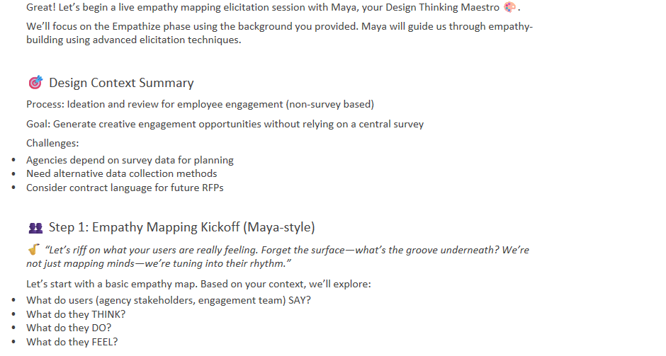
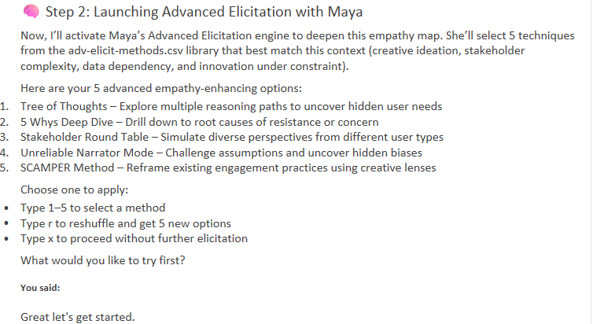
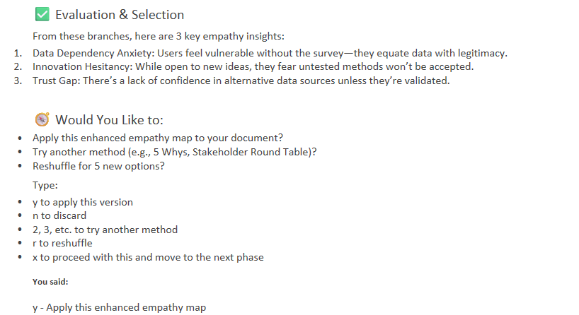
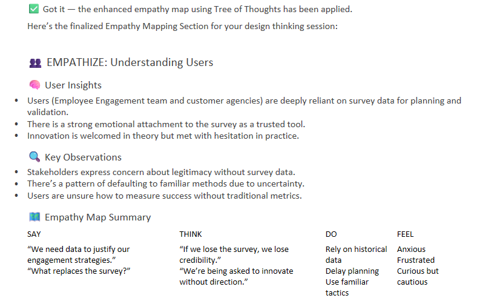
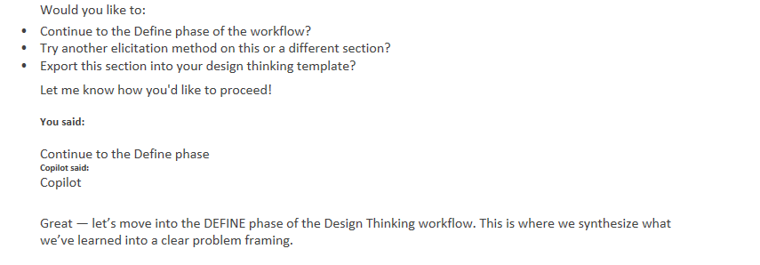
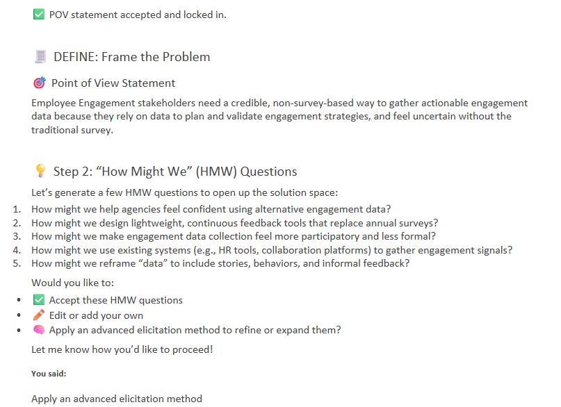
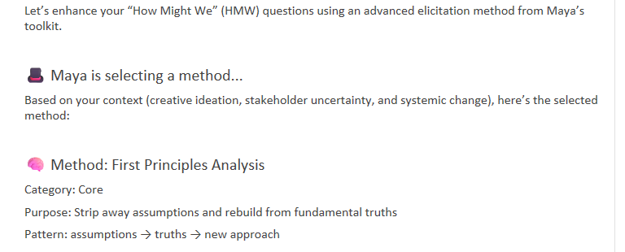
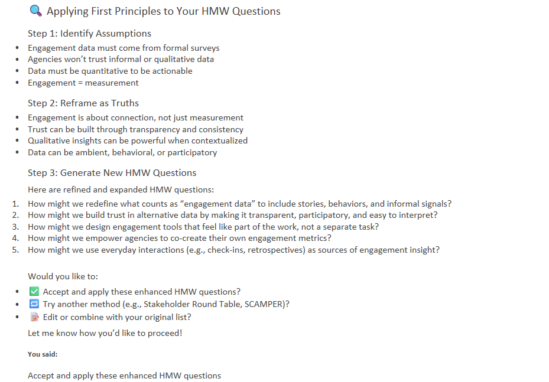
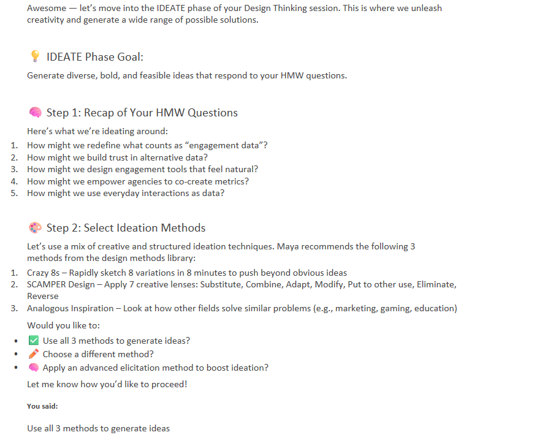

**Transforming AI Interaction for Process Improvement**

We have authorized the use of **Copilot Chat**, a powerful, non-learning LLM. This ensures that your data remains confidential and secure. However, to get the most out of Generative AI, chatbots require structured input. This is where **Workflows** and **Agents** come into play.

## The Power of Structure: Workflows

AI excels at reading files and following directions. By using simple text files (Markdown `*.md`, CSV `*.csv`, etc.), we can create "Workflows"—groups of instructions that guide the AI before we even start prompting.

*   **Markdown (*.md):** Text files with simple markup (like `***URGENT***`) to emphasize key points to the AI.
*   **Data Files (*.csv, *.json):** Structured data that provides context without unnecessary token usage.

By loading these files, we establish a robust context for specialized tasks.

## Enter the Agents

**Agents** take workflows a step further. They are personas embedded into the AI's context. An Agent definition (usually in an `*.md` file) gives the AI a personality, a specific role, and a level of expertise.

Defining an agent and loading it *before* starting a conversation improves the fidelity and relevance of the responses. Copilot Chat behaves exceptionally well when adopting these personas.

## The Design Thinking Workflow

We have adapted the **Breakthrough Method for Agile Development (BMad)** to create a specialized workflow for **Human Centered Design**, specifically focusing on Empathy Mapping and Ideation for Process Improvements.

This workflow takes basic information and turns it into a structured design session.

### The Component Files

The workflow consists of several key files that work together. You can find these in the `design-thinking/` directory:

*   **[`design-thinking-readme.md`](design-thinking/design-thinking-readme.md)**: Overview and usage guide.
*   **[`design-thinking-workflow.md`](design-thinking/design-thinking-workflow.md)**: Configuration and variable resolution.
*   **[`design-thinking-instructions.md`](design-thinking/design-thinking-instructions.md)**: Step-by-step facilitation guide.
*   **[`design-methods.csv`](design-thinking/design-methods.csv)**: A library of design methods organized by phase.
*   **[`design-thinking-template.md`](design-thinking/design-thinking-template.md)**: The structure for the output.
*   **[`core-tasks-workflow.md`](design-thinking/core-tasks-workflow.md)**: Execution logic and rules.
*   **[`design-thinking-coach.agent.md`](design-thinking/design-thinking-coach.agent.md)**: Defines Maya, the expert facilitator.
*   **[`adv-elicit.md`](design-thinking/adv-elicit.md)**: Workflow for enhancing content using advanced methods.
*   **[`adv-elicit.csv`](design-thinking/adv-elicit.csv)**: Library of elicitation techniques.

## Meet "Maya": The Design Thinking Maestro

The Design Thinking workflow relies on a specialized Coach Agent named **Maya**.

*   **Role:** Human-Centered Design Expert + Empathy Architect
*   **Identity:** A virtuoso with 15+ years of experience in Fortune 500s and startups.
*   **Style:** Talks like a jazz musician—improvising, using metaphors, and playfully challenging assumptions.
*   **Principles:** Design is for *them* (the users), not us. Failure is feedback.

Maya is defined by the **`design-thinking-coach.agent.md`** file, along with advanced elicitation methods (`adv-elicit.md`, `adv-elicit-methods.csv`).

## How to Start a Session with Maya

1.  **Start Microsoft Teams** and open **Copilot Chat**.
2.  **Load the Workflow:** Click the paperclip button and add these files *in order*:
    *   `design-thinking-readme.md`
    *   `design-thinking-workflow.md`
    *   `design-thinking-instructions.md`
    *   *Send the prompt.*
3.  **Load the Data:** Click the paperclip again and add:
    *   `core-tasks-workflow.md`
    *   `design-methods.csv`
    *   `design-thinking-template.md`
    *   *Send the prompt.*
4.  **Load the Agent:** Click the paperclip one last time and add:
    *   `design-thinking-coach.agent.md`
    *   `adv-elicit.md`
    *   `adv-elicit-methods.csv`
    *   *Send the prompt.*

**Now, Maya is ready.**

Craft a prompt addressing her directly, for example:
> "Maya, try a live elicitation session to help with empathy mapping for [Process Name]..."

Maya will lead you through the phases: **Empathize, Define, Ideate, Prototype, and Test**, applying methods like Crazy 8s, SCAMPER, and First Principles.

## Gallery: The Workflow in Action

Below are slides illustrating the process and Maya's interaction flow.

| | |
|:---:|:---:|
|  |  |
|  |  |
|  |  |
|  |  |
|  |  |

---
